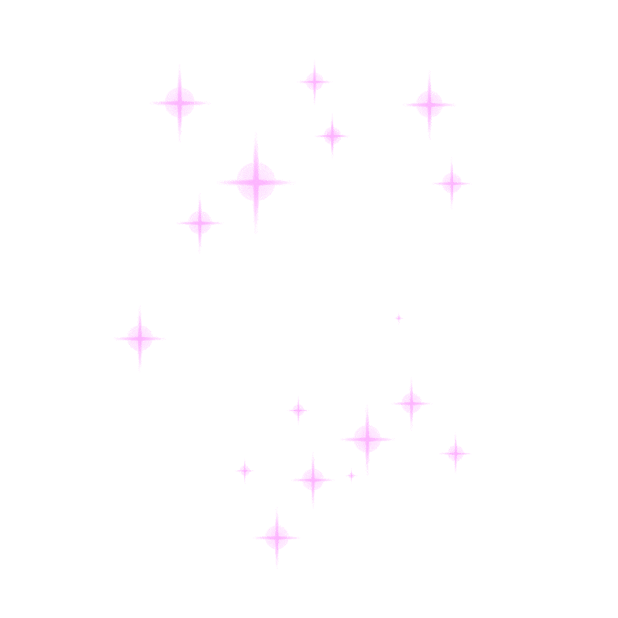

# <h1 align="center"> Hello World my name is Oleksandra! 
</h1>

### 
 :woman_technologist: I'm a beginning web developer. Although I have no professional experience, I am motivated, learning new techniques and improving my skills! 

 

   

- :telescope:  I’m currently learning TS/Redux

- :seedling: I'm currently working on a volunteer project!

- :zap: I am currently improving my skills and taking additional courses.

- :mailbox: Contacts:
-  

### 💻  Technologies:

  &nbsp
  &nbsp
  &nbsp
  &nbsp
  &nbsp
  &nbsp
  &nbsp
  &nbsp
  &nbsp;
  &nbsp;
  &nbsp;
  &nbsp;
  &nbsp;
  &nbsp;
  &nbsp;
  &nbsp;
  &nbsp;
  &nbsp;
  &nbsp;

### 🛠 Tools:

  &nbsp;
  &nbsp;
  &nbsp;
  &nbsp;
  &nbsp;
  &nbsp;
  &nbsp;
  &nbsp;
  &nbsp;
  &nbsp;

### GitHub Stats :

<table align="center">
  <tr>
  <td>
  
  </td>
  <td>
  
  </td>
  </tr>
  <tr>
  <td colspan=2 align="center">
 
  </td>
  </tr>
</table>

